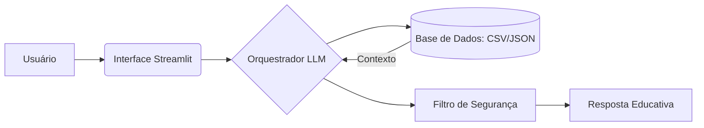

# 💰 FinTutor — Educador Financeiro
O FinTutor é um agente inteligente que atua como um educador financeiro pessoal, ajudando usuários a entender conceitos de finanças de forma simples, prática e acessível.

## 🎯 Objetivo

Facilitar o entendimento sobre finanças do dia a dia — como juros, orçamento e investimentos — sem linguagem técnica ou recomendações diretas, promovendo decisões mais conscientes.

## 💡 Como funciona

O FinTutor utiliza um modelo de linguagem (LLM) integrado a uma base de dados simulada para:
- Explicar conceitos financeiros de forma didática
- Analisar dados simples do usuário (ex: gastos)
- Adaptar respostas ao perfil do cliente
- Garantir segurança e evitar recomendações indevidas

## 🧠 Características do Agente
- 📚 Educativo e didático
- 🤝 Amigável e acessível
- 🚫 Não recomenda investimentos
- ⚠️ Evita alucinações (responde apenas com base nos dados)
- 🧩 Personaliza explicações com contexto do usuário

---
## 🏗️ Arquitetura
#### Diagrama

---
## 📂 Estrutura do Projeto

```
📁 lab-agente-financeiro/
│
├── 📄 README.md
│
├── 📁 data/                          # Dados mockados para o agente
│   ├── historico_atendimento.csv     # Histórico de atendimentos (CSV)
│   ├── perfil_investidor.json        # Perfil do cliente (JSON)
│   ├── produtos_financeiros.json     # Produtos disponíveis (JSON)
│   └── transacoes.csv                # Histórico de transações (CSV)
│
├── 📁 docs/                          # Documentação do projeto
│   ├── 01-documentacao-agente.md     # Caso de uso e arquitetura
│   ├── 02-base-conhecimento.md       # Estratégia de dados
│   ├── 03-prompts.md                 # Engenharia de prompts
│   ├── 04-metricas.md                # Avaliação e métricas
│   └── 05-pitch.md                   # Roteiro do pitch
│
├── 📁 src/                           # Código da aplicação
│   └── app.py                        # (exemplo de estrutura)
│
├── 📁 assets/                        # Imagens e diagramas
│   └── ...
│
└── 📁 examples/                      # Referências e exemplos
    └── README.md
```
---
## 📊 Base de Conhecimento

| Arquivo | Formato | Descrição |
|---------|---------|-----------|
| `transacoes.csv` | CSV | histórico financeiro|
| `historico_atendimento.csv` | CSV | interações anteriores |
| `perfil_investidor.json` | JSON | perfil do usuário |
| `produtos_financeiros.json` | JSON | produtos explicativos |
---
## 🛡️ Segurança

O FinTutor segue regras importantes:
- Não recomenda investimentos
- Não acessa dados sensíveis
- Não responde fora do escopo financeiro
- Assume quando não sabe algo

---
## 💬 Exemplo de Uso

Pergunta:

>"O que é a Selic?"

Resposta:
>"A Selic é a taxa básica de juros da economia. Quando ela sobe, empréstimos ficam mais caros e alguns investimentos rendem mais."

---
## 📈 Avaliação

O agente foi testado com foco em:

✔️ Assertividade  
✔️ Segurança  
✔️ Coerência

---
## 🚀 Possíveis melhorias
- Melhorar performance do modelo local
- Tratamento de erros mais robusto
- Expansão da base de conhecimento

---
## ⚙️ Tecnologias


