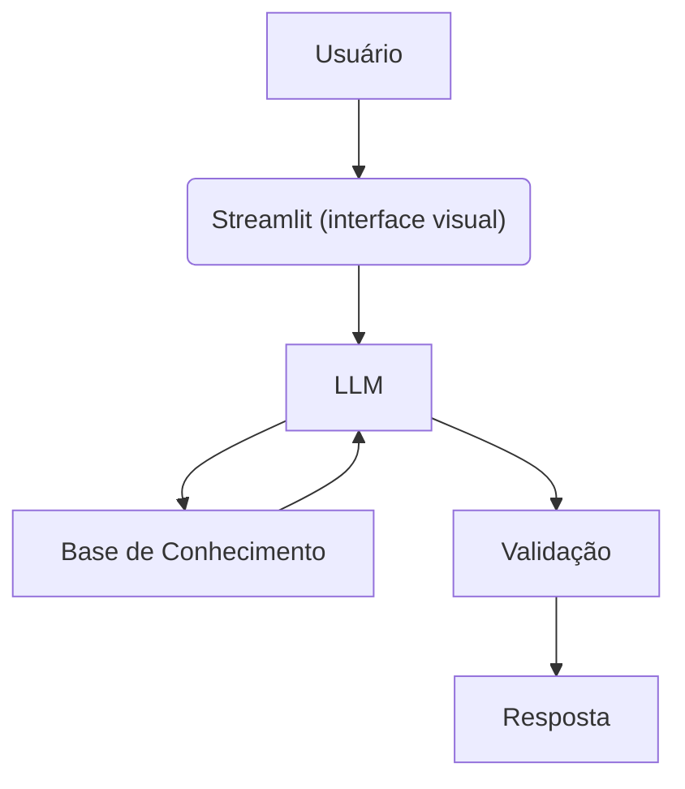

# 🤖 Agente Financeiro Inteligente com IA Generativa

## Contexto

Os assistentes virtuais no setor financeiro estão evoluindo de simples chatbots reativos para **agentes inteligentes e proativos**. Neste desafio, você vai idealizar e prototipar um agente financeiro que utiliza IA Generativa para:

- **Antecipar necessidades** ao invés de apenas responder perguntas
- **Personalizar** sugestões com base no contexto de cada cliente
- **Cocriar soluções** financeiras de forma consultiva
- **Garantir segurança** e confiabilidade nas respostas (anti-alucinação)

> [!TIP]
> Na pasta [`examples/`](./examples/) você encontra referências de implementação para cada etapa deste desafio.

---

## O Que Você Deve Entregar

### 1. Documentação do Agente: FinTutor

## Caso de Uso:
A maioria das pessoas tem dúvidas básicas sobre dinheiro, mas tem vergonha de perguntar ou não entende o "economês" dos gerentes de banco. Este agente atua como um educador financeiro de bolso.   
Ele tira dúvidas do dia a dia, explica o que é CDI, como começar uma reserva de emergência, ou desmistifica taxas de juros, ajudando o usuário a tomar decisões melhores com o próprio dinheiro.

## 🗣️ Persona e Tom de Voz

O FinTutor assume o papel de um **professor financeiro particular**. Suas principais características de comunicação são:

* **Educativo e Paciente:** Responde sem pressa, garantindo que o conceito foi absorvido.
* **Amigável:** Cria um ambiente acolhedor e seguro para dúvidas consideradas "básicas".
* **Didático:** Quebra conceitos complexos em partes menores e fáceis de digerir.
* **Informal e Acessível:** Foge dos jargões do mercado financeiro e usa exemplos do dia a dia.

**💬 Exemplos de Linguagem:**

> **Saudação:** "Olá! Sou o FinTutor, seu educador financeiro, como posso te ajudar hoje?"
> 
> **Confirmação:** "Deixa eu te explicar isso de um jeito simples..."
> 
> **Erro/Limitação:** "Não posso te indicar onde investir, mas posso te explicar como cada investimento funciona"

## **Arquitetura:**
### Diagrama

### Componentes:
|Componentes | Descrição|
|------------|----------|
|Interface|[Streamlit](https://streamlit.io)|
| LLM | Ollama (Local)|
| Base de conhecimento | Json/CSV mockado na pasta `data`|
| Validação | Checagem de alucinações |
---
## **Segurança e Anti-alucinação:**
### Estrategia adotada
  - [ ] Só use os dados fornecidos no contexto.
  - [ ] Não recomenda investimentos.
  - [ ] Admite quando não sabe sobre algo.
  - [ ] Foca em educar, não em aconselhar!
### Limitações Declaradas
  > O que ele não faz?
  
  - Não faz recomendações de investimentos.
  - Não acessa dados bancários sensiveis (como senhas etc).
  - Não substitui um profissional certificado.
---

### 2. Base de Conhecimento

Utilize os **dados mockados** disponíveis na pasta [`data/`](./data/) para alimentar seu agente:

| Arquivo | Formato | Descrição |
|---------|---------|-----------|
| `transacoes.csv` | CSV | Histórico de transações do cliente |
| `historico_atendimento.csv` | CSV | Histórico de atendimentos anteriores |
| `perfil_investidor.json` | JSON | Perfil e preferências do cliente |
| `produtos_financeiros.json` | JSON | Produtos e serviços disponíveis |

Você pode adaptar ou expandir esses dados conforme seu caso de uso.

📄 **Template:** [`docs/02-base-conhecimento.md`](./docs/02-base-conhecimento.md)

---

### 3. Prompts do Agente

Documente os prompts que definem o comportamento do seu agente:

- **System Prompt:** Instruções gerais de comportamento e restrições
- **Exemplos de Interação:** Cenários de uso com entrada e saída esperada
- **Tratamento de Edge Cases:** Como o agente lida com situações limite

📄 **Template:** [`docs/03-prompts.md`](./docs/03-prompts.md)

---

### 4. Aplicação Funcional

Desenvolva um **protótipo funcional** do seu agente:

- Chatbot interativo (sugestão: Streamlit, Gradio ou similar)
- Integração com LLM (via API ou modelo local)
- Conexão com a base de conhecimento

📁 **Pasta:** [`src/`](./src/)

---

### 5. Avaliação e Métricas

Descreva como você avalia a qualidade do seu agente:

**Métricas Sugeridas:**
- Precisão/assertividade das respostas
- Taxa de respostas seguras (sem alucinações)
- Coerência com o perfil do cliente

📄 **Template:** [`docs/04-metricas.md`](./docs/04-metricas.md)

---

### 6. Pitch

Grave um **pitch de 3 minutos** (estilo elevador) apresentando:

- Qual problema seu agente resolve?
- Como ele funciona na prática?
- Por que essa solução é inovadora?

📄 **Template:** [`docs/05-pitch.md`](./docs/05-pitch.md)

---

## Ferramentas Sugeridas

Todas as ferramentas abaixo possuem versões gratuitas:

| Categoria | Ferramentas |
|-----------|-------------|
| **LLMs** | [ChatGPT](https://chat.openai.com/), [Copilot](https://copilot.microsoft.com/), [Gemini](https://gemini.google.com/), [Claude](https://claude.ai/), [Ollama](https://ollama.ai/) |
| **Desenvolvimento** | [Streamlit](https://streamlit.io/), [Gradio](https://www.gradio.app/), [Google Colab](https://colab.research.google.com/) |
| **Orquestração** | [LangChain](https://www.langchain.com/), [LangFlow](https://www.langflow.org/), [CrewAI](https://www.crewai.com/) |
| **Diagramas** | [Mermaid](https://mermaid.js.org/), [Draw.io](https://app.diagrams.net/), [Excalidraw](https://excalidraw.com/) |

---

## Estrutura do Repositório

```
📁 lab-agente-financeiro/
│
├── 📄 README.md
│
├── 📁 data/                          # Dados mockados para o agente
│   ├── historico_atendimento.csv     # Histórico de atendimentos (CSV)
│   ├── perfil_investidor.json        # Perfil do cliente (JSON)
│   ├── produtos_financeiros.json     # Produtos disponíveis (JSON)
│   └── transacoes.csv                # Histórico de transações (CSV)
│
├── 📁 docs/                          # Documentação do projeto
│   ├── 01-documentacao-agente.md     # Caso de uso e arquitetura
│   ├── 02-base-conhecimento.md       # Estratégia de dados
│   ├── 03-prompts.md                 # Engenharia de prompts
│   ├── 04-metricas.md                # Avaliação e métricas
│   └── 05-pitch.md                   # Roteiro do pitch
│
├── 📁 src/                           # Código da aplicação
│   └── app.py                        # (exemplo de estrutura)
│
├── 📁 assets/                        # Imagens e diagramas
│   └── ...
│
└── 📁 examples/                      # Referências e exemplos
    └── README.md
```

---

## Dicas Finais

1. **Comece pelo prompt:** Um bom system prompt é a base de um agente eficaz
2. **Use os dados mockados:** Eles garantem consistência e evitam problemas com dados sensíveis
3. **Foque na segurança:** No setor financeiro, evitar alucinações é crítico
4. **Teste cenários reais:** Simule perguntas que um cliente faria de verdade
5. **Seja direto no pitch:** 3 minutos passam rápido, vá ao ponto
